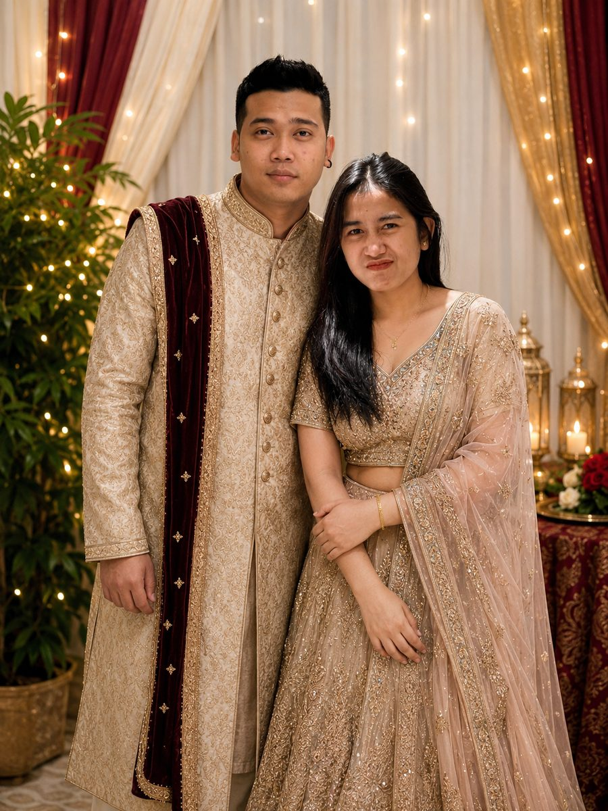

# Undangan Pernikahan — Sisy Syafira & Rizky Prayogi

Website undangan pernikahan tema India: hero animasi, efek hati jatuh (falling
hearts), hitung mundur, personalisasi nama tamu lewat link, RSVP, dan galeri.
Satu file HTML saja (`index.html`) — tidak perlu proses build apa pun.

## Struktur folder

```
wedding-site/
├── index.html        ← seluruh halaman (HTML+CSS+JS jadi satu)
├── music.mp3          ← file musik (harus sejajar dengan index.html, nama file harus "music.mp3")
└── README.md
```

Foto (opsional, jika ingin ditambahkan) bisa diupload langsung ke root repo juga,
misalnya `sisy.jpg`, `rizky.jpg`, `foto1.jpg`, dst — tinggal sesuaikan nama file
pada bagian `` di `index.html`.

## Apa saja yang perlu diganti

Buka `index.html`, cari komentar `<!-- GANTI ... -->` — semua ada di:
- Tanggal & waktu (hero, countdown, kartu acara) — juga baris
  `var targetDate = new Date('2026-12-12T08:00:00');` di bagian `<script>`
- Alamat lokasi akad & resepsi + link Google Maps (atribut `href="#"` pada `.map-btn`)
- Nama orang tua kedua mempelai
- Foto: ganti `<svg>...</svg>` placeholder dengan ``
- Nomor rekening & nama bank di bagian "Kirim Hadiah"
- Isi cerita cinta di bagian "Kisah Kami"

## Musik

Kamu yang mengatur musiknya sendiri — cukup pastikan file audio (mp3) bernama
persis `music.mp3` dan diletakkan **sejajar** dengan `index.html` di root repo
(lihat struktur folder di atas — jangan taruh di dalam folder lain).
Tombol bulat di pojok kanan bawah untuk play/pause.
Musik otomatis mencoba diputar saat tombol "Buka Undangan" ditekan (browser
tetap bisa memblokir autoplay tanpa interaksi, tapi karena ini dipicu oleh
klik tombol, umumnya berhasil).

## Personalisasi nama tamu

Tambahkan `?to=Nama%20Tamu` di akhir URL saat membagikan link, misalnya:

```
https://namakamu.github.io/wedding-site/?to=Bapak%20Andi
```

Nama tamu otomatis muncul di layar pembuka.

## RSVP

Form RSVP saat ini hanya tampilan depan (front-end) — mengetik dan mengirim
akan menampilkan pesan terima kasih, tapi datanya belum tersimpan ke mana pun.
Untuk menyimpan data sungguhan, pilih salah satu:
- Hubungkan ke [Google Form](https://forms.google.com) (ganti form RSVP dengan embed Google Form),
- atau gunakan layanan seperti Formspree / Getform (tambahkan `action` pada tag `<form>`).

## Deploy ke GitHub Pages

1. Buat repository baru di GitHub, misalnya `wedding-rizky-sisy`.
2. Upload `index.html`, `README.md`, `music.mp3`, `rizky.jpg`, `sisy.jpg`,
   dan foto galeri ke repository tersebut — semuanya sejajar di root, tidak
   di dalam folder (lewat web GitHub: "Add file" → "Upload files", atau
   lewat terminal):
   ```
   git init
   git add .
   git commit -m "Undangan pernikahan Rizky & Sisy"
   git branch -M main
   git remote add origin https://github.com/USERNAME/wedding-rizky-sisy.git
   git push -u origin main
   ```
3. Di repository GitHub, buka **Settings → Pages**.
4. Pada **Source**, pilih branch `main` dan folder `/ (root)`, lalu **Save**.
5. Tunggu 1–2 menit, situs akan aktif di:
   ```
   https://USERNAME.github.io/wedding-rizky-sisy/
   ```

Selesai — tinggal bagikan link tersebut (bisa ditambah `?to=Nama` untuk tiap tamu).

## Menambahkan foto galeri (kamu isi sendiri)

Foto galeri **belum diisi** — bagian ini sengaja dikosongkan supaya kamu bisa
tambahkan sendiri sesuka hati. Caranya:

1. Upload foto-foto kenangan ke root repo GitHub (sejajar dengan `index.html`,
   `rizky.jpg`, `sisy.jpg`, `music.mp3`) — beri nama sederhana, misalnya
   `foto1.jpg`, `foto2.jpg`, `foto3.jpg`, dst.
2. Buka `index.html`, cari komentar **"GALERI — di sini tempat kamu tambah
   foto sendiri"** di bagian `<div class="gallery-grid">`.
3. Ganti setiap baris `<div class="g-item"><svg>...</svg></div>` menjadi:
   ```html
   <div class="g-item"></div>
   ```
   Ulangi untuk tiap foto (foto2.jpg, foto3.jpg, dst). Boleh menambah atau
   mengurangi jumlah kotak sesuai jumlah foto yang kamu punya.

## Foto mempelai

Foto Rizky (`rizky.jpg`) dan Sisy (`sisy.jpg`) sudah terpasang di bagian
"Kedua Mempelai" — tinggal upload kedua file itu ke root repo dengan nama
persis `rizky.jpg` dan `sisy.jpg`.

